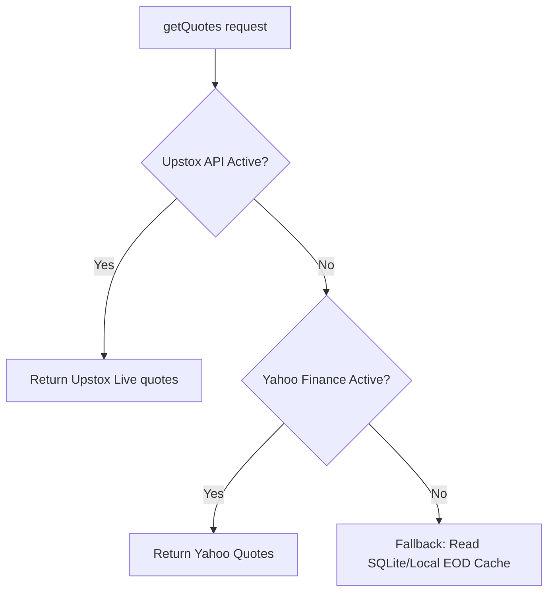
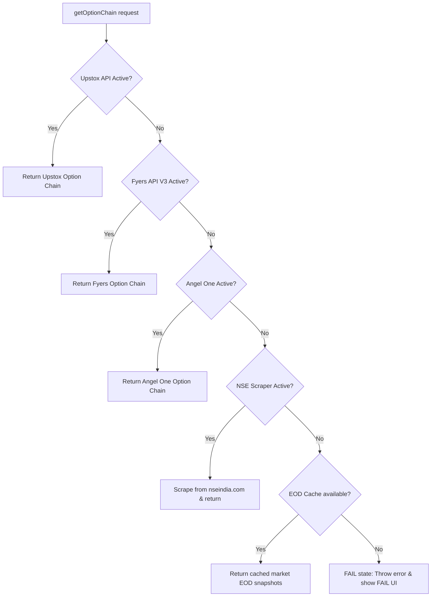

# Indian Stock Market Dashboard - complete PROJECT SUMMARY

Yeh document is project ki sabhi details ko ekdam simple aur highly detailed breakdown ke sath pesh karta hai. Iska maqsad yeh hai ki koi bhi naya AI agent ya developer is file ko read karke project ka flow, data sources, file structure, routing, server calls, aur configuration ko bina kisi confusion ke samajh sake aur naye features/pages easily add ya remove kar sake.

---

## 🚀 1. Project Kya Hai? (Project Overview)
Yeh ek **Professional Indian Stock Market Trading Dashboard** hai jismein live indices analytics (Nifty 50, Bank Nifty, Midcap Nifty, Sensex), Option Chain, Open Interest (OI) Analysis, Index Contributions (kis stock ne index ko kitne points up/down kiya), sector gainers/losers aur market heatmaps render hote hain. Is dashboard ka design high-end, dark-themed aur Bloomberg/TradingView-style modern aesthetic ke sath interactive animations aur charts (ECharts & Recharts) par chalta hai.

---

## 🛠️ 2. Tech Stack & Core Libraries (Kya-kya use kiya gaya hai)
*   **Core Framework**: **[TanStack Start](https://tanstack.com/router/latest/docs/start/overview)** (React + Vite + Nitro server-engine). Yeh ek full-stack React framework hai jo file-based routing aur server-side functions natively offer karta hai.
*   **Routing**: **[TanStack Router](https://tanstack.com/router)** (Strictly type-safe dynamic and static route management).
*   **State Management & Polling**: **[TanStack React Query](https://tanstack.com/query)** (Live market updates aur background polling management. Har page data ko fetch aur re-query karne ke liye dynamic intervals par queries chalata hai).
*   **Styling**: **Tailwind CSS v4** (Integrated via `@tailwindcss/vite` in `src/styles.css`). Custom theme tokens (e.g., Bullish/Bearish gradients, HSL colors) direct `@theme` rule mein defined hain.
*   **UI Components**: **Radix UI** primitives and icons from **Lucide React**, styled with **Shadcn UI** specifications.
*   **Charts / Graphics**:
    *   **ECharts (via `echarts-for-react`)**: Real-time complex data structures (e.g., Index Contribution waterfalls).
    *   **Recharts**: Standard analytical charts.
*   **Package Manager**: **Bun** & **npm** (Vite builds run natively on Node/Bun environment).
*   **Database**: **better-sqlite3** (Used for local EOD/historical storage, symbol mapping cache, and persistent tables on the backend).

---

## 📁 3. Project Structure & Directory Layout (Files Kahan-Kahan Hain)
Niche project ke important components ki complete mapping di gayi hai:

```
indiandeshboard/
├── package.json                    # Project dependencies aur scripts (dev, build, preview)
├── vite.config.ts                  # Vite, TanStack Router plugin aur Tailwind v4 configuration
├── tsconfig.json                   # TypeScript config aur path aliases (e.g. "@/*" -> "src/*")
├── .env / .env.example             # Secrets aur API keys (Upstox, AngelOne, Fyers credentials)
├── fyers_config.enc                # Encrypted Fyers session file (AES-256-CBC)
├── angel_one_scrip_master.json     # Filtered Instrument token database (Angel One ke liye)
├── upstox_instruments.json         # Filtered Instrument token database (Upstox ke liye)
├── eod_cache/                      # Offline historical/EOD database cache files (.json formats)
├── docs/                           # Project guides aur tasks logs (PROJECT_MASTER.md, CURRENT_TASK.md)
└── src/
    ├── server.ts                   # TanStack Start backend server-side entrance
    ├── start.ts                    # TanStack Start client-side runtime entrance
    ├── router.tsx                  # Client router component injection
    ├── routeTree.gen.ts            # Auto-generated routing mapping (TanStack built file, do not edit)
    ├── styles.css                  # Tailwind CSS imports & Custom Design variables
    ├── hooks/                      # Custom React Hooks
    │   ├── useMarketOpen.ts        # Check karta hai market active trading hours mein hai ya nahi
    │   └── useDebounce.ts          # Input parameters, search filters, aur select dropdowns ko delay dene ke liye
    ├── lib/                        # Backend connection layers & RPC calls
    │   ├── services/               # Brokers connect services
    │   │   ├── marketDataLayer.ts  # Fallback routing orchestrator (Pehle Broker A, fir B, fir Scrapers, fir Cache)
    │   │   ├── upstoxService.ts    # Upstox API integrations (NSE instrument processing)
    │   │   ├── angelOneService.ts  # Angel One API credentials, dynamic login aur instrument search
    │   │   ├── fyersService.ts     # Fyers V3 API integration (Primary option chain feed)
    │   │   ├── nseFallbackService.ts # Live NSE official website scraper layer (cookie & payload based)
    │   │   ├── yahooService.ts     # Yahoo Finance API (Fallback ticks and sparklines data)
    │   │   ├── persistentCache.ts  # Local file storage caching operations
    │   │   └── database.server.ts  # SQLite query operations (tables structure, historical database)
    │   ├── market.functions.ts     # Server RPC function (Quotes, index lists, sector gains, index weightage)
    │   ├── nse.functions.ts        # Server RPC function (Option chain contracts, dynamic scanner signals, PCR)
    │   └── dashboard-query.ts      # React Query options, cache state limits aur API endpoints query keys definition
    ├── components/                 # Global UI controls
    │   ├── DashboardShell.tsx      # Main Layout shell (Sidebar menu, header, dark-mode toggle, responsive drawer)
    │   ├── TickingNumber.tsx       # Live number updating animation component (Green/Red highlights on price ticks)
    │   ├── ui/                     # UI components like Card, Dropdown, Table, Input, Slider, Progress (Shadcn UI)
    │   └── TopTicker/              # Moving quotes ticker at the header
    └── routes/                     # Front-end pages (TanStack Router automatic mappings)
        ├── __root.tsx              # Root HTML markup shell (Head tags, global providers setup)
        ├── index.tsx               # Main Dashboard page (Market summary, market breadth, sector indices, AI sentiment)
        ├── optionchain.tsx         # Option Chain Dashboard (CE/PE tables, support resistance, strike ranges)
        ├── index-contribution.tsx  # Index Weightage Contribution Page (Reliance, HDFC Bank index points impact)
        ├── screener.tsx            # Live F&O Scanner (buildup signals, volume shockers, cap tags, day highs/lows)
        ├── oi-analysis.tsx         # Open Interest buildup charts, sentiment radial gauges, PCR ratios
        ├── heatmap.tsx             # Grid layout sector heatmaps
        └── sector.$key.tsx         # Sector-wise constituents pages (banking, IT, pharma stocks lists)
```

---

## 🔄 4. Live Data Sources & Fallback Architecture
Dashboard kisi ek broker API ke band hone par fail nahi hota. Isme **Multi-Tier Fallback Mechanism** implementation kiya gaya hai:

### Live Quotes Data Flow (Nifty 50, Stocks prices)


### Live Option Chain & OI Data Flow


---

## ⚡ 5. Server-Side RPC Functions Explained (`.functions.ts`)
TanStack Start framework server code aur client components ko split karne ke liye server functions offer karta hai. Yeh files client ke build bundle mein hide rehti hain aur runtime par standard HTTP request ke zariye call hoti hain:

1.  **`src/lib/market.functions.ts`**
    *   `getDashboard()`: Landing page ka bulk data load karta hai. Isme indices, sector indices, top gainers, top losers aur market advance-decline parameters calculate hote hain.
    *   `getQuotes(symbols[])`: Live LTP (Last Traded Price), net change aur percentage changes fetch karta hai.
    *   `getIndexConstituents(indexSymbol)`: Chosen index (e.g., NIFTY, BANKNIFTY) ke andar aane wale sub-stocks aur unke weightage list fetch karta hai.
    *   `getIndexContributions(indexSymbol)`: Sub-stocks ke live weightages aur unke net change percentages ko apply karke index points contribution (kis share ki wajah se index kitne points badha ya gira) return karta hai.
2.  **`src/lib/nse.functions.ts`**
    *   `getOptionChain(symbol, spot, expiry)`: Options parameters load karta hai. Spot prices detect karke, ATM (At-The-Money) aur PCR (Put-Call Ratio) calculate karta hai. Sath hi, call/put open interest add karke dynamic support and resistance (S1, S2, R1, R2) compute karta hai.
    *   `getLiveScannerData()`: F&O Scanner (buildup radar) ka core logic engine hai. Har stock ke live quotes + futures statistics evaluate karke signals generate karta hai:
        *   *Long Buildup*: Price up, OI up.
        *   *Short Buildup*: Price down, OI up.
        *   *Short Covering*: Price up, OI down.
        *   *Long Unwinding*: Price down, OI down.
        *   *Volume Shocker*: Volume ratio > 2.0.
        *   *Score Calculation*: `calcAiScore()` parameters evaluate karke 0 se 100 ke beech AI score assign karta hai.

---

## 🗺️ 6. Naya Page Kaise Add Karein? (Step-by-Step AI Guide)
Naye page ko integrate karne ke liye standard architecture flows follow karein:

### Step 1: Create the Router Entry in `src/routes/`
TanStack Router file-based system par kaam karta hai. Naya page design karne ke liye `src/routes/` folder ke andar ek naya `.tsx` file banayein.
E.g., Agar aapko `/portfolio` link chalana hai, toh `src/routes/portfolio.tsx` file banayein:

```tsx
// src/routes/portfolio.tsx
import { createFileRoute } from "@tanstack/react-router";
import { DashboardShell } from "@/components/DashboardShell";

function PortfolioPage() {
  return (
    <DashboardShell>
      <div className="p-4 text-slate-200">
        <h1 className="text-xl font-bold">My Stock Portfolio</h1>
        <p className="text-xs text-slate-400">Welcome to portfolio tracker!</p>
      </div>
    </DashboardShell>
  );
}

export const Route = createFileRoute("/portfolio")({
  head: () => ({
    meta: [
      { title: "My Portfolio — Indian Stock Market Dashboard" },
      { name: "description", content: "Track stock portfolios with live feeds." }
    ],
  }),
  component: PortfolioPage,
});
```

*Note: File-route create hone ke baad build system background compiler command ke through routing definitions `src/routeTree.gen.ts` file mein automatically register kar dega.*

### Step 2: Add Page Components inside `src/features/`
Agar page complex analytics carry karta hai toh business logic ko `src/features/` folder mein divide karein:
*   Create directory: `src/features/portfolio/`
*   Add sub-components (e.g. `PortfolioTable.tsx`, `PortfolioChart.tsx`).
*   Inhe main page file `src/routes/portfolio.tsx` ke andar render karein.

### Step 3: Link Page in Sidebar Menu
Sidebar configuration **`src/components/DashboardShell.tsx`** file mein hardcoded structure array me hoti hai.
Wahan search karein links array aur usme apna naya route add karein:
```typescript
{
  name: "Portfolio",
  href: "/portfolio",
  icon: BriefcaseIcon,
}
```

---

## 🔒 7. Page Remove/Modify Kaise Karein?
1.  **Remove Page**: Route file delete karein (e.g. `src/routes/portfolio.tsx`). Dev server running rakhein taaki `routeTree.gen.ts` file clean ho jaye.
2.  **Clean up Links**: `src/components/DashboardShell.tsx` ke navigation items array se link ko delete karein.
3.  **Clean up Features**: Feature specific component directories (`src/features/portfolio/`) ko manually delete karein agar unka koi dependency baaki modules mein na ho.

---

## ⚡ 8. Important Rules for Code Modification & Performance
AI agent ko coding ke dauran niche diye gaye guidelines ko must follow karna chahiye:

### 1. Vite Client/Server Compilation Boundary
Server-side operations (like database connections, file systems access, decrypted tokens, API credentials) ko hamesha server function files (`*.functions.ts` or inside `createServerFn`) ke andar hi declare karein. Client pages (`src/routes/*.tsx` or `src/features/**/*.tsx`) par kabhi bhi directly node modules import na karein warna client-side bundler compiler crashes trigger karega.

### 2. TanStack Query Background Updates (Prevent layout shifting / jump)
React Query background polling refresh har page par data updates inject karta hai. Layout jump aur flickers ko control karne ke liye:
*   Queries declare karte waqt `placeholderData: keepPreviousData` ka use must karein:
    ```typescript
    const query = useQuery({
      ...optionChainQuery(symbol),
      placeholderData: keepPreviousData, // background poll hotey waqt previous data screen par hold rahega
    });
    ```
*   First load checker ke liye `isLoading` ki jagah `isPending` query variables state check karein, taaki background sync checks full screen spinner generate na kar sake.

### 3. Memoization Strategy
Live updating tables aur graph metrics render karte waqt:
*   Bars, Tooltips, Radial indicators, and Table lines components ko React wrapper components mein memoize karein:
    ```tsx
    import { memo } from "react";
    export const MyComponent = memo(MyComponentBase);
    ```
*   `useMemo` aur `useCallback` dependency parameters arrays ko completely fill karein taaki unstable reference changes and unnecessary repaints avoid ho sakein.

### 4. Build Validation
Kisi bhi change/checkpoint ko push karne se pehle frontend aur backend integration tests validation check karne ke liye production build command run karein:
```bash
NITRO_PRESET=node-server npm run build
```
*Note: plain `npm run build` bina NITRO_PRESET ke production VM (Ubuntu node-server) par 502 Bad Gateway error create kar sakta hai.*

---

## 🏆 9. Completed Distributed Market Data Architecture (July 2026)
Recently, the core market data layer has been upgraded to a highly robust **Distributed Market Data Architecture** spanning four phases:
1. **Unified Symbol Mapping & SENSEX (Phase 1)**: Integrated `SENSEX` across all layers, replacing `MIDCAPNIFTY` references in core layouts, and introduced a unified symbol mapper (`resolveSymbol()`) for resolving standard symbols across Upstox, Angel One, Fyers, Yahoo, and NSE.
2. **Broker API Protection & Session Concurrency (Phase 2)**: Solved Angel One concurrent login totp token locks. Bypassed modern F5 firewall blocks on Angel One via modern endpoints. Implemented auto-reconnects and protected Fyers API from locking on non-auth errors.
3. **Fallback Routing & Sanity Checks (Phase 3)**: Implemented a central orchestrator (`marketDataLayer.ts`) with custom feature categories and automated fallback paths:
   * **Quotes**: `upstox` ➔ `yahoo` ➔ `EOD cache`
   * **Futures/OI**: `angelone` ➔ `nse`
   * **Option Chain**: `upstox` ➔ `fyers` ➔ `angelone` ➔ `nse` ➔ `EOD cache` ➔ `FAIL` (strictly no mock or synthetic data).
   * **3-Strike Circuit Breaker**: Auto-bypasses failed brokers on 4th call.
   * **IST Market-Hours & Quote Sanity Guard**: Prevents bad ticks and rate limit wastage.
4. **Data Lineage UI & Polish (Phase 4)**: Added real-time source badges and latency indicators in Option Chain and OI Analysis Pro pages. Since mock data is forbidden, any data-source failure results in a clean EOD or FAIL state.
5. **Key Bug Fixes**:
   * **AI Lab Divide-by-Zero**: Fixed `+Infinity%` index price ticks on loading state by defaulting baseline properties to spot price, and adding `Data Pending` labels in `public/ai-analysis.html` if `prevClose` is zero.
   * **Isolated Cache Keys**: Solved persistent cache-collision by hashing symbol lists to generate isolated EOD snapshot keys (avoiding overwrites between stocks and index quotes).

---

Yahi is Indian Stock Market Dashboard project ki blueprint summary hai. Naye integrations add karte waqt existing services (`src/lib/services/marketDataLayer.ts`) aur fallbacks system ka leverage karein.
